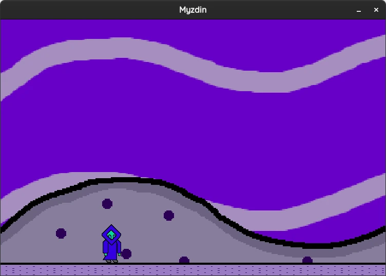

# Myzdin-x86_64

## Gameplay


## About
A simple 2D palformer game written in C using SDL2. This game is only supported for Linux. This game is in alpha software. There are going to be features missing.

## Dependencies
* gcc (GNU GCC Compiler)
	* build-essential (Debian and Ubuntu distros and its derivatives)
* libsdl2-dev
* libsdl2-mixer-dev
* libsld2-image-dev
* meson
* ninja-build

## Manual Install (Ubuntu 22.04.2 LTS)


## Building the project
Go the root of my repository
```
cd Myzdin-x86_64
```

Set up the build directory
```
cmake -B build
```

Go to build directory
```
cd build
```

Compile the project
```
cmake --build .
```

## Assets (Music, Art and Soundeffects)
<a rel="license" href="http://creativecommons.org/licenses/by/4.0/"></a><br />I created the music, art and soundeffects for this game. The assets are licensed under a <a rel="license" href="http://creativecommons.org/licenses/by/4.0/">Creative Commons Attribution 4.0 International License</a>.
