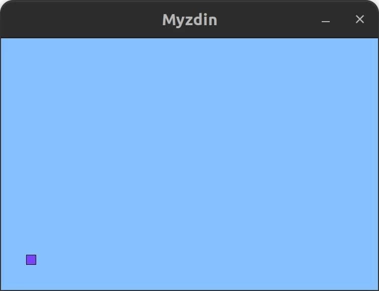

# Myzdin

## Gameplay


## About
A simple 2D game written in C using SDL2.

## Dependencies
* gcc (GNU GCC Compiler)
* build-essential
* clang
* libsdl2-dev
* libsdl2-mixer-dev
* libsdl2-image-dev
* cmake

Install thsese dependencies on Ubuntu or Debian based distros
```
sudo apt install gcc build-essential clang libsdl2-dev libsdl2-mixer-dev libsdl2-image-dev cmake
```

### Optional
* clang-format
* clang-tidy
* clangd

Install thsese dependencies on Ubuntu or Debian based distros
```
sudo apt install clang-format clang-tidy clangd
```

## Manual Install (Ubuntu 22.04.2 LTS)
[manual_install_sdl2](./docs/manual_install_sdl2.md)

## Building the project
Set up the build directory
```
cmake -B build
```

Go to build directory
```
cd build
```

Compile the project
```
cmake --build .
```
